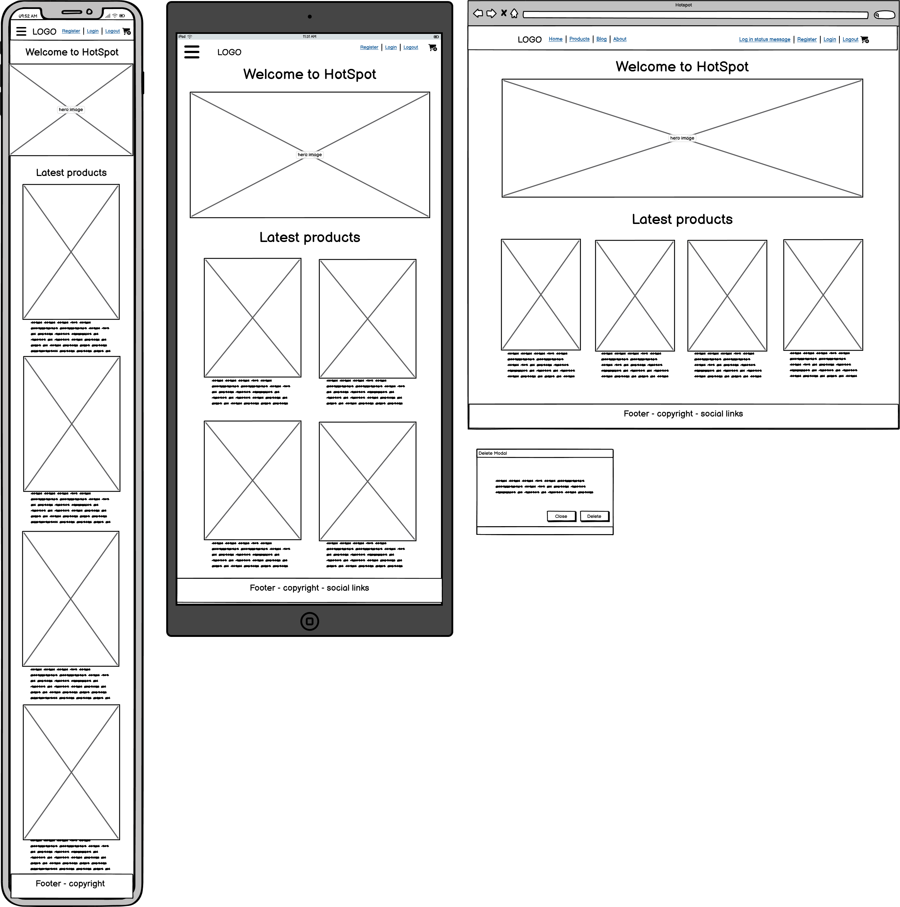
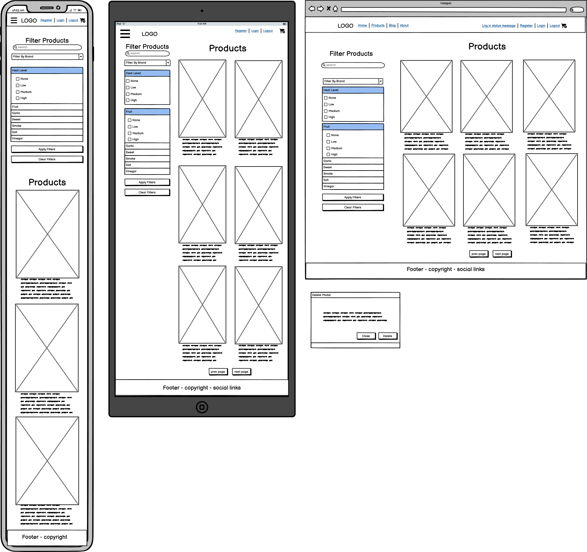
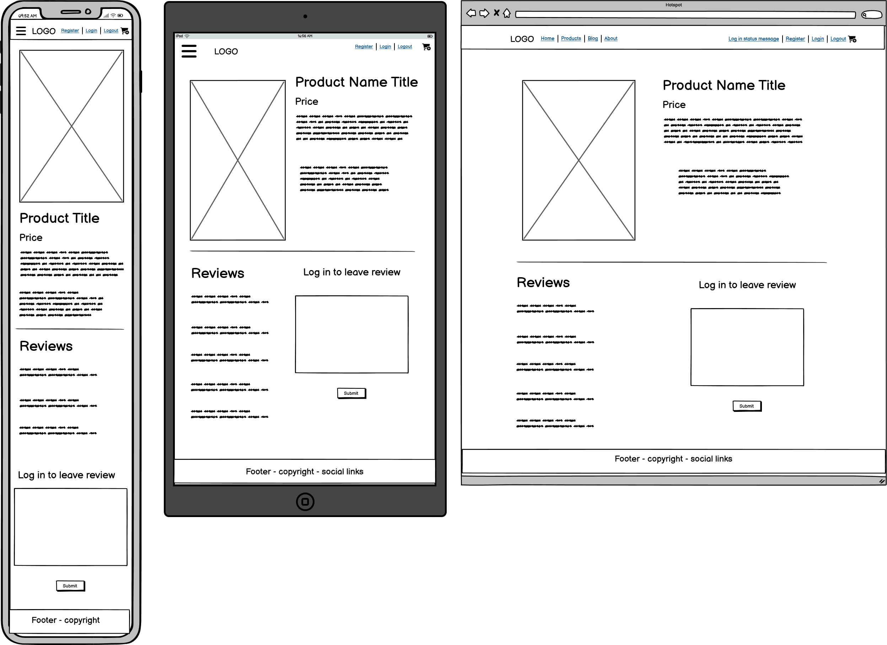
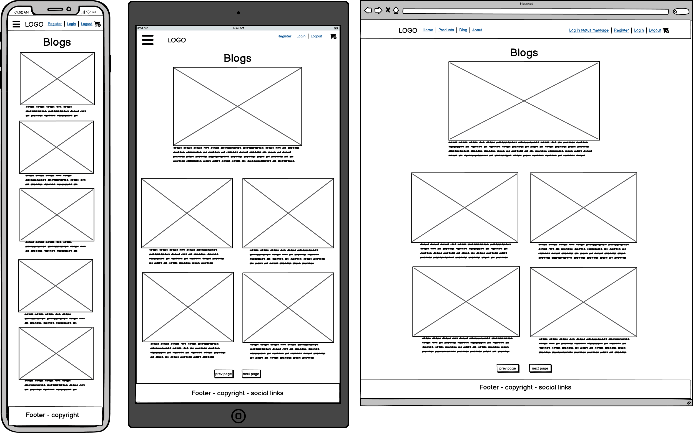
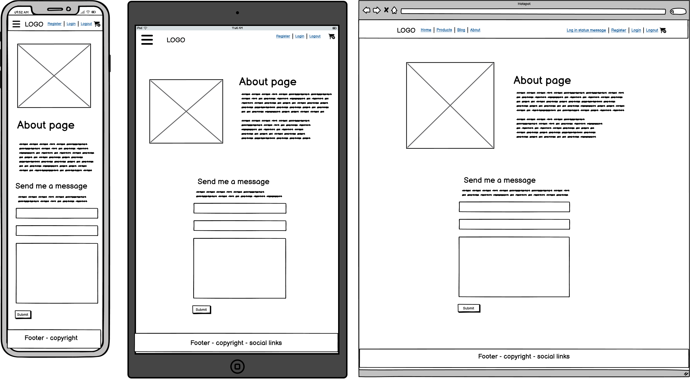
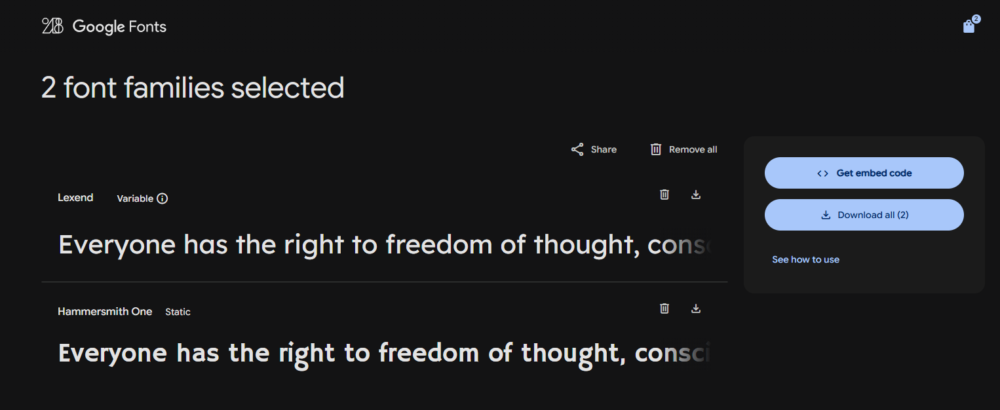
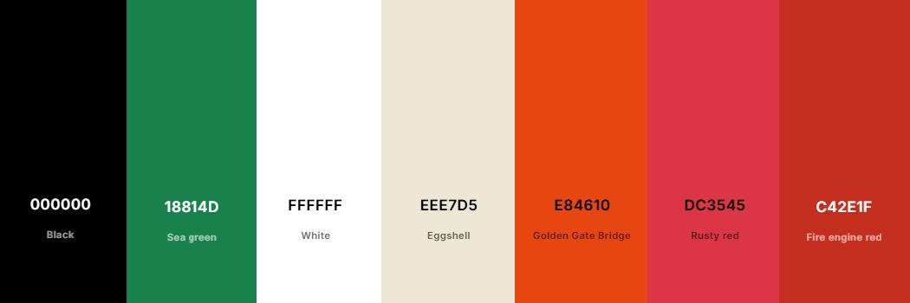

# HotSpot

## Overview
HotSpot is a Django-based web application designed for hot sauce enthusiasts to discover, review, and shop for a curated selection of hot sauces. The platform combines a modern, responsive design (using Bootstrap 5) with robust user features, including authentication, product reviews, and admin management. The site holds a Products page with a collection of items with reviews, and a Blogs page with user created blogs for hot sauce related content like recipes. Product Reviews and Blog comments has full CRUD functionality, enabling users to create, read, update, and delete reviews efficiently.

## UX Design

### Link to User Stories in GitHub Projects:
[GitHub Projects Kanban Board](https://github.com/users/wen-l-liu/projects/10)

### Wireframes:
Wireframes were created to ensure intuitive navigation, clear product presentation, and accessibility for all users.
Here are wireframes for all the pages of the website.

  
<strong>Wireframe Designs</strong>

  

  
<strong>Homepage Wireframe</strong>

  
  

  

  
<strong>Products Wireframe</strong>

  
  

  

  
<strong>Products details Wireframe</strong>

  
  

  

  
<strong>Blogs page Wireframe</strong>

  
  

  

  
<strong>Blogs details Wireframe</strong>

  
  

  

  
<strong>About page Wireframe</strong>

  
  

### Design Rationale:
The layout emphasises simplicity and clarity, with Bootstrap 5 ensuring a responsive experience across devices. The color palette and typography were chosen for readability and accessibility, following WCAG guidelines.
Accessibility features include keyboard navigation, ARIA labels, and screen reader support.

#### Fonts selection
I used Google Fonts to pick my fonts.
Primary font is - Lexend for main website text.
Secondary font is - Hammersmith One for logo brand font.

  

  
<strong>Fonts image</strong>

  
  

#### Colours ####

  

  
<strong>Colour palette</strong>

  
  

The primary colour theme for HotSpot is red, reflecting the heat and excitement associated with hot sauces. Red is energetic, eye-catching, and immediately communicates the spicy nature of the products. To provide visual contrast and highlight positive actions (such as success messages or confirmation buttons), green is used sparingly—this contrast draws attention to important interactive elements without overwhelming the user.

A mostly white background with black text is used throughout the site for simplicity and maximum readability. This clean, minimal approach ensures that content remains the focus, and that the vibrant red and green accents stand out effectively for calls to action and key feedback.

### Reasoning For Any Final Changes:
User feedback led to improvements in navigation flow, review visibility, and mobile responsiveness. Adjustments were made to enhance inclusivity and overall user satisfaction.

## Key Features

- **Product Catalogue:** Browse, filter, and search a wide range of hot sauces by category or brand.
- **Product Detail Pages:** View detailed information, images, and reviews for each sauce.
- **User Authentication:** Register, log in securely.
- **Product Reviews:** Leave and read reviews to help the community make informed choices.
- **Admin Management:** Admins can add, edit, or remove products, manage categories, and moderate reviews.
- **Notifications:** Users receive feedback on actions (e.g., successful login, review submission).
- **Inclusivity Notes:** Accessibility features include ARIA labels, alt text for images, and keyboard navigation.

## Deployment

- **Platform:** Heroku (or your chosen platform)
- **High-Level Deployment Steps:**
  1. Clone the repository.
  2. Set up the environment with PostgreSQL (or your chosen database).
  3. Configure environment variables for sensitive data (e.g., secret keys, API keys).
  4. Deploy using Heroku Git, GitHub integration, or your preferred method.
- **Verification and Validation:**
  - The deployed application was tested for consistent functionality, design, and accessibility using tools like Lighthouse and manual testing.
- **Security Measures:**
  - Sensitive data is stored in environment variables.
  - DEBUG mode is disabled in production for enhanced security.

## AI Implementation

### Use Cases and Reflections

Throughout the development of HotSpot, GitHub Copilot was used to streamline coding, debugging, and testing.

- **Code Creation:**
  - Copilot accelerated the creation of Django models, views, and forms, suggesting best practices and efficient patterns. It was especially helpful for generating boilerplate code and exploring alternative approaches.
- **Data Creation:**
  - Copilot was just to generate json to populate comments and review models.
- **Debugging:**
  - Copilot provided insightful suggestions for resolving errors and simplifying complex logic.
- **Performance and UX Optimisation:**
  - The AI suggested impactful Bootstrap tweaks, improving the visual polish and responsiveness of the site.
  - Copilot assisted in optimising and simplifying my Django view functions, suggesting efficient query patterns and helping to minimise unnecessary database calls for faster performance.
- **Automated Unit Testing:**
  - Copilot assisted in generating initial test cases, helping to cover edge cases and improve the robustness of the application.

### Overall Impact

Using Copilot transformed the workflow, reducing the time taken for ideas to move from the brain to the machine. While not every suggestion was perfect, the AI served as a valuable collaborator, enhancing both technical and problem-solving skills.

## User Stories

### User
1. As a User, I can easily register, log in, and log out so I can browse and interact with the site.
2. As a User, I can easily navigate the website so that I can find and discover new items.
3. As a User, I can view a list of products so that I can find the item I want.
4. As a User, I can filter and sort products so that I can find the item I want.
5. As a User, I can search products so that I can find the item I want.
6. As a User, I can view more information on a product so that it can help me make a purchase decision.
7. As a User, I can add one or more products to my basket, view my basket, change item quantities, and remove items so that I can manage my order.
8. As a User, I can view products by category or brand so that I can find what I'm looking for.
9. As a User, I can update and save my profile information so that I can easily buy again.
10. As a User, I can contact the site admin so that I can get help or report issues.
11. As a User, I can see notifications when completing actions so that I know my action was successful.
12. As a User, I can see and write reviews so that I can give feedback and help others choose.
13. As a User, I can use a chatbot to get help on issues.
14. As a User, I can access blog to find articles related to spicy sauce.
15. As a User, I can leave comments on blog articles and start a discussion.

### Site Admin

16. As a Site Admin, I can add new products to the list so that users can see new products.
17. As a Site Admin, I can edit or remove existing products so that the product catalogue stays accurate and up to date.
18. As a Site Admin, I can manage product categories and brands so that products are organised for users.
19. As a Site Admin, I can view, approve, or remove user reviews so that product feedback remains appropriate.
20. As a Site Admin, I can view and manage customer orders so that I can process sales and handle issues.
21. As a Site Admin, I can access site analytics and reports so that I can monitor sales and user activity.
22. As a Site Admin, I can add new blog posts to the list so that users can see new articles.
23. As a Site Admin, I can edit blog posts to update articles for users.
24. As a Site Admin, I can view, approve, or remove user comments so that blog post feedback remains appropriate.

## Testing Summary

- **Manual Testing:**
  - **Devices and Browsers Tested:** Windows 11 (Chrome, Edge, Brave), Android.
  - **Assistive Technologies:** Tested using Lighthouse and manual keyboard navigation.
  - **Features Tested:** Registration, login, product browsing, product editing, reviews, blog posts & comments, and admin features.
  - **Results:** All critical features, including accessibility checks, worked as expected.
- **Automated Testing:**
  - Tools Used: Django TestCase, GitHub Copilot.
  - Features Covered: User authentication, product CRUD, review system, and accessibility compliance.
  - Adjustments Made: Manual tweaks to ensure comprehensive test coverage and inclusivity.

**Login Credential for testing:**  
Username: andrew  
Password: testerAA
andrew benjamin charlotte daniel emily fiona grace henry isaac james kevin lucy matthew nathan olivia quinn rachel samuel thomas victoria william xavier yvonne zoe
Capitalise the first letter of their name as Password.

### HTML Validation
HTML was first checked using Copilot in VS Code, then deployed to Heroku so that the URL could be run through the [W3C HTML validator](https://validator.w3.org/).
Only minor issues occurred due to apostrophes in product names causing parse errors, added |escape to product.name.
Blog articles had errors as cripsy froms applied alot of extra HTML tags and CSS in the HTML pageload, I removed the form content stylings and passed the test.

  

  
<strong>Homepage</strong>

  
  

  

  
<strong>Products Page</strong>

  
  

  

  
<strong>Product details Page</strong>

  
  

  

  
<strong>About Page</strong>

  
  

  

  
<strong>Blogs Page</strong>

  
  

  

  
<strong>Blog article</strong>

  
  

### CSS Validation
CSS was validated with [Jigsaw](https://jigsaw.w3.org/css-validator) with no errors.
  

  
<strong>Styles.CSS</strong>

  
  

### Python Validation
Python admin, models, forms and settings files was first checked in VScode using copilot, then validated with [CodeInstitute Python Linter](https://pep8ci.herokuapp.com/) with no errors, no issues.

  

  
<strong>settings python</strong>

  
  

## Future Enhancements

- Add cart functionality so products can be added to cart.
- Add order processing capability, to process a purchase order.
- Integrate advanced analytics for tracking user engagement and sales trends.
- Add chatbot capabilities for more interactive user assistance.
- Implement a recommendation system for personalised product suggestions.
- Optimise performance further with advanced caching strategies and code splitting.
- Regularly update the accessibility features to comply with the latest standards and guidelines.

## Credits

### Content & Inspiration
- Product items, images and descriptions were sourced from [heatonist](https://heatonist.com/).
- Blog articles were adapted from blogs from [Hops Burns & Black](https://www.hopburnsblack.co.uk/) written by Claire M Bullen.
- Inspiration for site structure and features was drawn from leading hot sauce e-commerse, review and blog platforms.
  - [Heatonist](https://heatonist.com/)
  - [Some like it hot](https://somelikeithot.shop/)
  - [Hot Headz](https://hot-headz.com/)
  - [Hops Burns & Black](https://www.hopburnsblack.co.uk/)

### Design & Assets
- **Wireframes:** Created using [Balsamiq](https://balsamiq.com/) and [Figma](https://www.figma.com/).
- **Icons:** [Font Awesome](https://fontawesome.com/) for social and UI icons.
- **Images:** Hot Sauce Product images sourced from [heatonist](https://heatonist.com/).
- **Colour Palette & Fonts:** Google Fonts (Lexend, Hammersmith One) and [Coolors](https://coolors.co/) for palette inspiration.

### Libraries & Frameworks
- [Django](https://www.djangoproject.com/) – Python web framework.
- [Bootstrap 5](https://getbootstrap.com/) – Responsive CSS framework.
- [Crispy Forms](https://django-crispy-forms.readthedocs.io/) – For improved Django form rendering.
- [django-allauth](https://django-allauth.readthedocs.io/) – User authentication.
- [django-summernote](https://github.com/summernote/django-summernote) – Rich text editing for admin.
- [Cloudinary](https://cloudinary.com/) – Image hosting and management.

### Tools & Services
- [Heroku](https://heroku.com/) – Deployment platform.
- [GitHub](https://github.com/) – Version control and project management.
- [W3C Validator](https://validator.w3.org/) – HTML validation.
- [Jigsaw CSS Validator](https://jigsaw.w3.org/css-validator/) – CSS validation.

### AI Assistance
- [GitHub Copilot](https://github.com/features/copilot) – Used for code suggestions, debugging, and test generation.

### Special Thanks
- The Code Institute community and mentors for guidance and support.
- Friends and testers who provided feedback and helped improve the site’s usability and accessibility.

---

