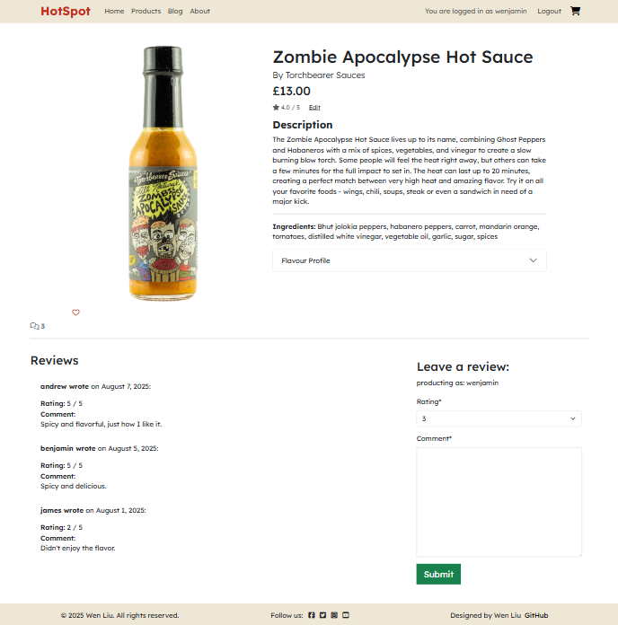
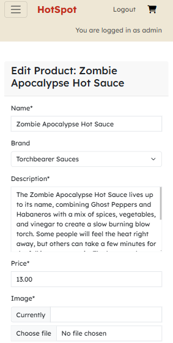
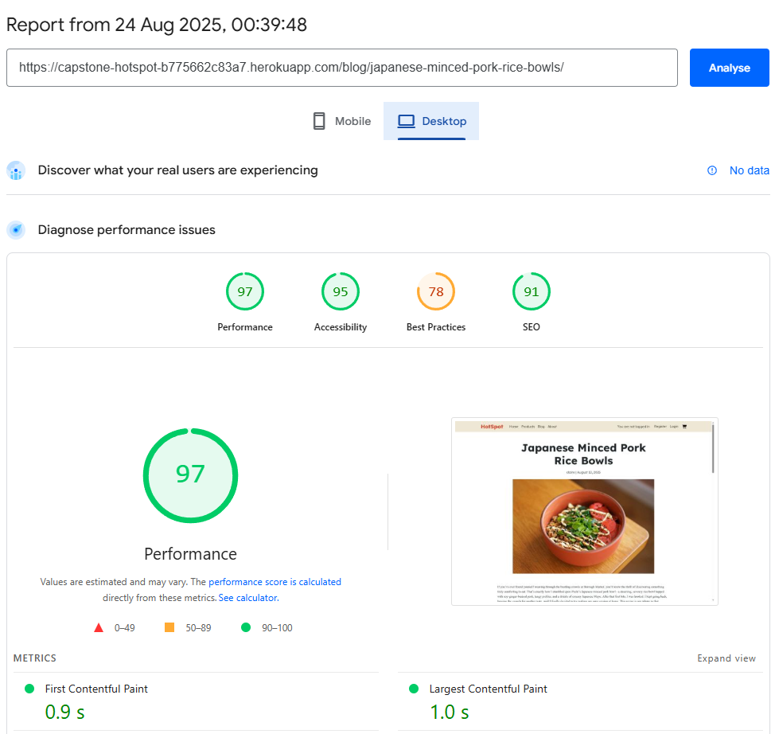

# HotSpot
[Link to Live website](https://capstone-hotspot-b775662c83a7.herokuapp.com/)

## Overview
HotSpot is a web application built with Django that allows fans of hot sauce to discover, review, and shop from a curated selection of hot sauces. The platform combines a modern, responsive design using Bootstrap with robust user features, including authentication, product reviews, and admin management. The site features a Products page with a collection of items with reviews, and a Blogs page with user-generated content such as recipes and other hot sauce-related content. With full CRUD functionality for product reviews and blog comments, users can easily create, read, update, and delete feedback.

## Table of Contents

- [Overview](#overview)
- [Entity Relationship Diagram (ERD)](#entity-relationship-diagram-erd)
- [UX Design](#ux-design)
  - [User Stories](#user-stories)
  - [Wireframes](#wireframes)
  - [Design Rationale](#design-rationale)
    - [Fonts selection](#fonts-selection)
    - [Colours](#colours)
- [Agile](#agile)
- [Key Features](#key-features)
- [Website Overview](#website-overview)
- [Testing & Validation](#testing--validation)
  - [Django Testing](#django-testing)
  - [HTML Validation](#html-validation)
  - [CSS Validation](#css-validation)
  - [Python Validation](#python-validation)
  - [Accessibility evaluation](#accessibility-evaluation)
  - [Lighthouse](#lighthouse)
- [Deployment](#deployment)
- [AI Implementation](#ai-implementation)
- [Future Enhancements](#future-enhancements)
- [Credits](#credits)

## Entity Relationship Diagram (ERD)

Below is the ERD for HotSpot, illustrating the relationships between users, products, reviews, brands, flavours, blog posts, comments, and collaboration requests.

- **User:** Represents registered users who can write reviews, blog posts, and comments.
- **Brand:** Each product is associated with a brand, which includes a name, description, and image.
- **Product:** The central entity, representing each hot sauce. Products belong to a brand and have attributes such as name, description, price, image, ingredients, and an average rating (calculated from reviews).
- **Flavour:** Each product has a one-to-one relationship with a flavour profile, detailing attributes like heat level, fruitiness, garlic, sweetness, smokiness, saltiness, and vinegar strength.
- **Review:** Users can leave reviews for products. Each review is linked to a product and an author (user), and includes a rating, comment, approval status, and timestamp. Reviews are used to calculate the product’s average rating.
- **Blog Post:** Users can create blog posts. Each post is linked to an author (user), has a unique title and slug, featured image, content, excerpt, status (draft or published), and timestamps for creation and updates. Posts are ordered by creation date, with the most recent first.
- **Comment:** Users can comment on blog posts. Each comment is linked to a blog post and an author (user), contains the comment body, approval status, and creation timestamp. Comments are ordered chronologically.
- **About:** Stores a single “about me” entry, including a title, profile image, last updated timestamp, and content. This provides background information about the site or its creator.
- **CollaborateRequest:** Stores collaboration request messages submitted via the site. Each request includes the sender’s name, email, message, and a read/unread status for admin management.

This structure supports a rich user experience, allowing users to interact through reviews, blog posts, and comments, while products are clearly linked to brands and flavour profiles. The ERD visually represents these relationships, supporting both user engagement and admin management features.

## UX Design

#### Link to User Stories in GitHub Projects:
[GitHub Projects Kanban Board](https://github.com/users/wen-l-liu/projects/10)

### User Stories

#### User
1. As a User, I can easily register, log in, and log out so I can browse and interact with the site.
2. As a User, I can easily navigate the website so that I can find and discover new items.
3. As a User, I can view a list of products so that I can find the item I want.
4. As a User, I can filter and sort products so that I can find the item I want.
5. As a User, I can search products so that I can find the item I want.
6. As a User, I can view more information on a product so that it can help me make a purchase decision.
7. As a User, I can add one or more products to my basket, view my basket, change item quantities, and remove items so that I can manage my order.
8. As a User, I can view products by category or brand so that I can find what I'm looking for.
9. As a User, I can update and save my profile information so that I can easily buy again.
10. As a User, I can contact the site admin so that I can get help or report issues.
11. As a User, I can see notifications when completing actions so that I know my action was successful.
12. As a User, I can see and write reviews so that I can give feedback and help others choose.
13. As a User, I can use a chatbot to get help with issues.
14. As a User, I can access the blog to find articles related to spicy sauce.
15. As a User, I can leave comments on blog articles and start a discussion.

#### Site Admin

16. As a Site Admin, I can add new products to the list so that users can see new products.
17. As a Site Admin, I can edit or remove existing products so that the product catalogue stays accurate and up to date.
18. As a Site Admin, I can manage product categories and brands so that products are organised for users.
19. As a Site Admin, I can view, approve, or remove user reviews so that product feedback remains appropriate.
20. As a Site Admin, I can view and manage customer orders so that I can process sales and handle issues.
21. As a Site Admin, I can access site analytics and reports so that I can monitor sales and user activity.
22. As a Site Admin, I can add new blog posts to the list so that users can see new articles.
23. As a Site Admin, I can edit blog posts to update articles for users.
24. As a Site Admin, I can view, approve, or remove user comments so that blog post feedback remains appropriate.

### Wireframes:
Wireframes were created to ensure intuitive navigation, clear product presentation, and accessibility for all users.
Here are wireframes for all the pages of the website.

#### Wireframe Designs

  

  
<strong>Homepage Wireframe</strong>

  
  

  

  
<strong>Products Wireframe</strong>

  
  

  

  
<strong>Products details Wireframe</strong>

  
  

  

  
<strong>Blogs page Wireframe</strong>

  
  

  

  
<strong>Blogs details Wireframe</strong>

  
  

  

  
<strong>About page Wireframe</strong>

  
  

### Design Rationale:
The layout emphasises simplicity and clarity, with Bootstrap 5 ensuring a responsive experience across devices. The colour palette and typography were chosen for readability and accessibility, following WCAG guidelines.
Accessibility features include keyboard navigation, ARIA labels, and screen reader support.

#### Fonts selection
I used Google Fonts to choose my fonts.
Primary font is Lexend for main website text.
Secondary font is Hammersmith One for the logo brand font.

  

  
Fonts image

  
  

#### Colours

HotSpot's primary colour scheme is red, which symbolises the spiciness and intensity of hot sauces. Red conveys the products' spicy nature immediately and is vibrant and striking. Green is used sparingly to create visual contrast and highlight positive actions (such as confirmation buttons or success messages). This contrast highlights key interactive elements without being overpowering to the user.

For simplicity and optimal readability, the website is primarily white with black text. The content remains the main focus thanks to this simple, minimalistic design, and the vivid red and green accents effectively draw attention to calls to action and important feedback.

  

  
Colour palette

  
  

### Reasoning For Any Final Changes:
User feedback led to improvements in navigation flow, review visibility, and mobile responsiveness. Adjustments were made to enhance inclusivity and overall user satisfaction.

## Agile
Agile development was used to create this project, focusing on incremental and iterative progress. I began by building the main navigation and implementing essential user authentication features such as sign-up and login, ensuring users could access and interact with the site from the outset.”
I then included the product catalogue, which lets users browse and see comprehensive details about every hot sauce. I launched the review system, which allowed users to rate products and share feedback, after the product's functionality was stable. Following the establishment of these essential features, I added an About page to give background information and, lastly, a blog section to encourage community participation and distribute content about hot sauce. Throughout the development process, feedback and validation guided continuous improvement as each feature was tested and improved in cycles.

I used [GitHub Projects Kanban Board](https://github.com/users/wen-l-liu/projects/10) to track my progress and to add tasks.

  

  
<strong>Sprint 1</strong>

  
  

- Started with basic webpage designs and navigation, with account registration and login functionality. 

  

  
<strong>Sprint 2</strong>

  
  

- Added product catalogue and product description pages

  

  
<strong>Sprint 3</strong>

  
  

- Added feedback for notifications, sign in, sign out and review deletion notifications
- Implemented product reviews and product editing without using the Admin panel

  

  
<strong>Sprint 4</strong>

  
  

- Added blog section for articles and recipes about spicy dishes
- Implemented blog comments for community interaction

  

  
<strong>Sprint 5</strong>

  
  

- Added product search functionality, search from name, description and ingredients
- Added filter by flavour profile and heat levels using the Flavours model for each product

## Key Features

- **Product Catalogue:** Browse, filter, and search a wide range of hot sauces by category or brand.
- **Product Detail Pages:** View product description, image, ingredients, and reviews for each sauce.
- **User Authentication:** Register, log in securely.
- **Product Reviews:** Leave and read reviews to help the community make informed choices.
- **Admin Management:** Admins can edit products and blog posts directly on the website, without needing to use the Django admin panel.
- **Notifications:** Users receive feedback on actions (e.g., successful login, review submission).
- **Inclusivity Notes:** Accessibility features include ARIA labels, alt text for images, and keyboard navigation.

### Website Overview

Page | Desktop | Mobile |
--- | --- | --- |
| Home |  |  |
| Products |  |  |
| Product Details |  |  |
| Blogs Page |  |  |
| Blog Details |  |  |
| Product Admin Edit |  |  |
| Blog Post Admin Edit |  | |

## Testing & Validation

- **Manual Testing:**
  - **Devices and Browsers Tested:** Windows 11 (Chrome, Edge, Brave), Android.
  - **Assistive Technologies:** Tested using Lighthouse and manual keyboard navigation.
  - **Features Tested:** Registration, login, product browsing, product editing, reviews, blog posts & comments, and admin features.
  - **Results:** All critical features, including accessibility checks, worked as expected.
- **Automated Testing:**
  - Tools Used: Django TestCase, GitHub Copilot.
  - Features Covered: User authentication, product CRUD, review system, and accessibility compliance.
  - Adjustments Made: Manual tweaks to ensure comprehensive test coverage and inclusivity.

**Login Credentials for testing:**  
Username: andrew  
Password: testerAA

List of usernames:
andrew, benjamin, charlotte, daniel, emily, fiona, grace, henry, isaac, james, kevin, lucy, matthew, nathan, olivia, quinn, rachel, samuel, thomas, victoria, william, xavier, yvonne, zoe

Capitalise the first letter of their name as Password.

### Django Testing
I created a set of test cases in tests.py using Django's built-in Python testing framework to evaluate my application. These tests cover core features such as model behaviour, view responses, form validation, authentication, and filtering logic. By utilising Django’s TestCase class, I was able to simulate user interactions, verify expected outcomes, and identify potential issues early in development. Automated testing provided confidence that new features and changes did not cause problems, helping to maintain code quality and reliability.”

  

  
tests.py

  
  

### HTML Validation
HTML was first checked using Copilot in VS Code, then deployed to Heroku so that the URL could be run through the [W3C HTML validator](https://validator.w3.org/).
Only minor issues occurred due to apostrophes in product names causing parse errors; added |escape to product.name.
Blog articles had errors as crispy forms applied a lot of extra HTML tags and CSS in the HTML pageload; I removed the form content stylings and passed the test.

  

  
<strong>Homepage</strong>

  
  

  

  
<strong>Products Page</strong>

  
  

  

  
<strong>Product details Page</strong>

  
  

  

  
<strong>About Page</strong>

  
  

  

  
<strong>Blogs Page</strong>

  
  

  

  
<strong>Blog article</strong>

  
  

### CSS Validation
CSS was validated with [Jigsaw](https://jigsaw.w3.org/css-validator) with no errors.
  

  
<strong>Styles.CSS</strong>

  
  

### Python Validation
Python admin, models, forms and settings files were first checked in VS Code using Copilot, then validated with [CodeInstitute Python Linter](https://pep8ci.herokuapp.com/) with no errors, no issues.

  

  
<strong>settings python</strong>

  
  

### Accessibility evaluation
The [WAVE Tool](https://wave.webaim.org/) was used throughout development to identify and resolve accessibility issues. WAVE helped highlight missing or incorrect ARIA labels, insufficient colour contrast, and improper heading structure. All pages were tested and iteratively improved based on WAVE’s feedback to ensure the site is accessible to users with disabilities.

**Semantic Heading Levels:**
During validation, heading levels were reviewed and adjusted for semantic correctness, also addressing WAVE warnings about missing or skipped heading levels.
**Colour Palette Adjustments:**
The original palette included an orange accent, but this was removed after WAVE flagged low contrast with white backgrounds.
The final palette uses red as the primary accent, with green for positive actions.
**Fieldsets and Legends**
For filters in the product page, there were WAVE warnings about missing fieldsets and legends. All filter groups in forms (such as brand, heat, and flavour profile filters) are wrapped in `<fieldset>` elements with a visually hidden `<legend>`. This ensures accessibility for screen readers while maintaining a clean visual design for sighted users.

  

  
<strong>Homepage</strong>

  
  

  

  
<strong>Product</strong>

  
  

  

  
<strong>Product details</strong>

  
  

  

  
<strong>Blogs</strong>

  
  

  

  
<strong>Blog details</strong>

  
  

### Lighthouse
Lighthouse reports showed strong results for the site, with performance, accessibility, and SEO scores consistently in the 90s on desktop. Best Practices averaged in the 80s, with minor recommendations for improvement. On mobile devices, performance scores were slightly lower, typically in the high 70s, due to increased resource demands. Overall, the site delivers a fast, accessible, and well-optimised experience across platforms.

  

  
<strong>Homepage</strong>

  
  

  

  
<strong>Product</strong>

  
  

  

  
<strong>Product details</strong>

  

  <strong>Product details mobile</strong>

  
  

  

  
<strong>Blogs page</strong>

  

<strong>Blog page mobile</strong>

  
  

  

  
<strong>Blog details</strong>

<strong>Blog details mobile</strong>

  
  

## Deployment

- **Platform:** Heroku (or your chosen platform)
- **High-Level Deployment Steps:**
  1. Clone the repository.
  2. Set up the environment with PostgreSQL (or your chosen database).
  3. Configure environment variables for sensitive data e.g.:
      - Secret Key
      - Database URL
      - Cloudinary URL
  4. Deploy using Heroku Git, GitHub integration, or your preferred method.
- **Verification and Validation:**
  - The deployed application was tested for consistent functionality, design, and accessibility using tools like Lighthouse and manual testing.
- **Security Measures:**
  - Sensitive data is stored in environment variables.
  - DEBUG mode is disabled in production for enhanced security.

## AI Implementation

### Use Cases and Reflections

Throughout the development of HotSpot, GitHub Copilot was used to streamline coding, debugging, and testing.

- **Code Creation:**
  - Copilot accelerated the creation of Django models, views, and forms, suggesting best practices and efficient patterns. It was especially helpful for generating boilerplate code and exploring alternative approaches.
- **Data Creation:**
  - Copilot was used to generate JSON to populate comments and review models.
- **Debugging:**
  - Copilot provided insightful suggestions for resolving errors and simplifying complex logic.
- **Performance and UX Optimisation:**
  - The AI suggested impactful Bootstrap tweaks, improving the visual polish and responsiveness of the site.
  - Copilot assisted in optimising and simplifying my Django view functions, suggesting efficient query patterns and helping to minimise unnecessary database calls for faster performance.
- **Automated Unit Testing:**
  - Copilot assisted in generating initial test cases, helping to cover edge cases and improve the robustness of the application.

### Overall Impact

Using Copilot transformed the workflow, reducing the time taken for ideas to move from the brain to the machine. While not every suggestion was perfect, the AI served as a valuable collaborator, enhancing both technical and problem-solving skills.

## Future Enhancements

- Add cart functionality so products can be added to the cart.
- Add order processing capability, to process a purchase order.
- Integrate advanced analytics for tracking user engagement and sales trends.
- Add chatbot capabilities for more interactive user assistance.
- Implement a recommendation system for personalised product suggestions.
- Optimise performance further with advanced caching strategies and code splitting.
- Regularly update the accessibility features to comply with the latest standards and guidelines.

## Credits

### Content & Inspiration
- Product items, images and descriptions were sourced from [heatonist](https://heatonist.com/).
- Blog articles were adapted from blogs from [Hops Burns & Black](https://www.hopburnsblack.co.uk/) written by Claire M Bullen.
- Inspiration for site structure and features was drawn from leading hot sauce e-commerce, review and blog platforms.
  - [Heatonist](https://heatonist.com/)
  - [Some like it hot](https://somelikeithot.shop/)
  - [Hot Headz](https://hot-headz.com/)
  - [Hops Burns & Black](https://www.hopburnsblack.co.uk/)

### Design & Assets
- **Wireframes:** Created using [Balsamiq](https://balsamiq.com/).
- **Icons:** [Font Awesome](https://fontawesome.com/) for social and UI icons.
- **Images:** Hot Sauce Product images sourced from [heatonist](https://heatonist.com/).
- **Colour Palette & Fonts:** Google Fonts (Lexend, Hammersmith One) and [Coolors](https://coolors.co/) for palette inspiration.

### Libraries & Frameworks
- [Django](https://www.djangoproject.com/) – Python web framework.
- [Bootstrap 5](https://getbootstrap.com/) – Responsive CSS framework.
- [Crispy Forms](https://django-crispy-forms.readthedocs.io/) – For improved Django form rendering.
- [django-allauth](https://django-allauth.readthedocs.io/) – User authentication.
- [django-summernote](https://github.com/summernote/django-summernote) – Rich text editing for admin.
- [Cloudinary](https://cloudinary.com/) – Image hosting and management.

### Tools & Services
- [Heroku](https://heroku.com/) – Deployment platform.
- [GitHub](https://github.com/) – Version control and project management.
- [W3C Validator](https://validator.w3.org/) – HTML validation.
- [Jigsaw CSS Validator](https://jigsaw.w3.org/css-validator/) – CSS validation.

### AI Assistance
- [GitHub Copilot](https://github.com/features/copilot) – Used for code suggestions, debugging, and test generation.

### Special Thanks
- The Code Institute community and mentors for guidance and support.
- Friends and testers who provided feedback and helped improve the site’s usability and accessibility.

